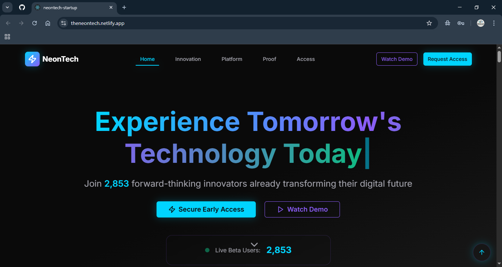

# NeonTech Startup Landing Page ⚡

A futuristic, minimalist startup landing page built with **React** and **Tailwind CSS**. Featuring a sleek dark theme, glowing neon accents, smooth animations, and a clean layout to showcase your products or services. Perfect for startups, SaaS, and tech companies looking for a modern web presence.

---

## Features

- **Modern Design:** Dark mode with neon highlights for a cutting-edge look.
- **Responsive Layout:** Optimized for mobile, tablet, and desktop screens.
- **Smooth Animations:** Subtle transitions and interactive elements for enhanced UX.
- **Customizable:** Easily adapt colors, content, and branding to fit your needs.
- **Fast & Lightweight:** Built with React and Tailwind CSS for quick load times.

---

## Demo

[Live Demo](https://theneontech.netlify.app/)



---

## Getting Started

### Prerequisites

- [Node.js](https://nodejs.org/) (v14 or newer recommended)
- [npm](https://www.npmjs.com/) or [yarn](https://yarnpkg.com/)

### Installation

```bash
git clone https://github.com/Reteecent/neontech.git
cd neontech
npm install
```

### Running Locally

```bash
npm run dev
```

The app will run locally at [http://localhost:3000](http://localhost:3000).

---

## Customization

- **Branding:** Replace the logo and company name in `src/components/Header.jsx`.
- **Colors:** Update neon accent colors via `tailwind.config.js`.
- **Content:** Modify the landing page sections in `src/components` as needed.
- **Animations:** Adjust or add animations in the relevant component files.

---

## Project Structure

```
neontech/
├── public/
│   └── index.html
├── src/
│   ├── assets/        # Images, logos, icons
│   ├── components/    # Reusable React components
│   ├── App.jsx        # Main app logic
│   └── index.js       # Entry point
├── tailwind.config.js # Tailwind CSS configuration
├── package.json
├── screenshot.png     # Project preview image
└── README.md
```

---

## Technologies Used

- **React** – UI library for building interactive interfaces
- **Tailwind CSS** – Utility-first CSS framework
- **JavaScript** – Main programming language
- **CSS/HTML** – Styling and structure

---

## Contributing

Contributions, issues, and feature requests are welcome!

1. Fork the repository
2. Create your feature branch: `git checkout -b feature/YourFeature`
3. Commit your changes: `git commit -m 'Add YourFeature'`
4. Push to the branch: `git push origin feature/YourFeature`
5. Open a pull request

---

## License

[MIT](LICENSE)

---

## Contact

- **Author:** [Reteecent](https://github.com/Reteecent)
- **Repository:** [github.com/Reteecent/neontech_startup](https://github.com/Reteecent/neontech)

---

> Crafted with ⚡ by Reteecent
````
